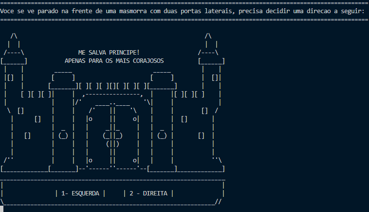
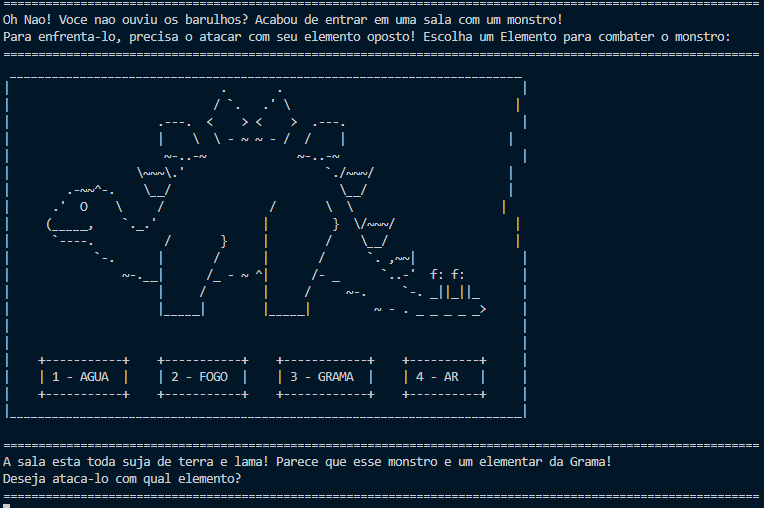
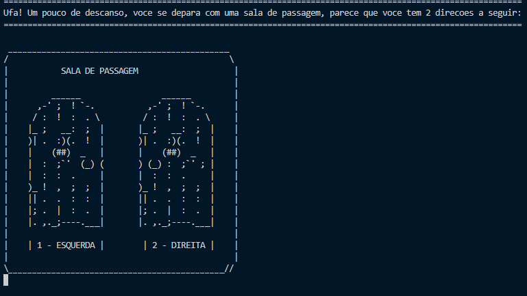
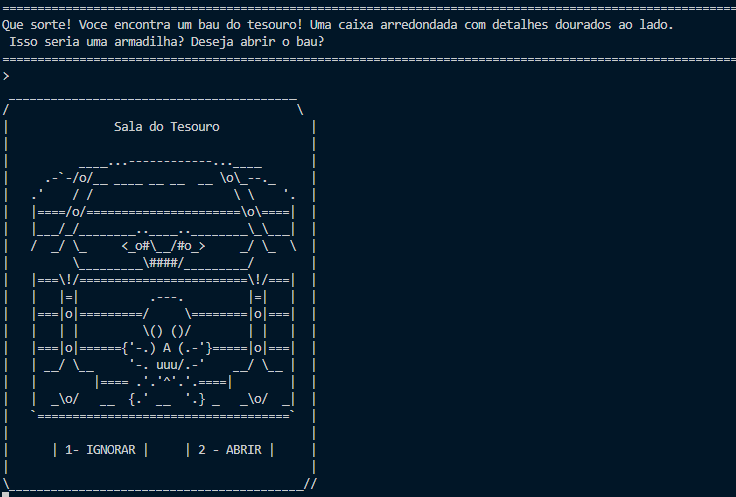
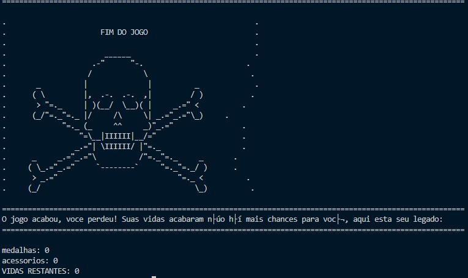

# :video_game: Menu Game

+ [Descrição do Jogo](#descrição-do-jogo) 📖
+ [Imagens do Jogo](#imagens-do-jogo) 📷
+ [Como Jogar](#como-jogar) 🕹️
+ [Como Foi Construído](#como-foi-construído) 🔨
+ [Autores](#autores) 👥
+ [Informações Adicionais](#informações-adicionais) ℹ️

## Descrição do Jogo
# Me Salva, Príncipe! :crown:

"**Me Salva, Príncipe!**" é uma aventura interativa onde cada escolha molda o destino do seu personagem. Como um valente príncipe, seu objetivo é salvar a princesa aprisionada no fim da masmorra. No entanto, o caminho não será fácil. Tesouros ocultos, monstros elementais e armadilhas perigosas estão entre os muitos desafios que você enfrentará.

### Como Funciona
- **Escolhas Importantes**: Em cada tela, você encontrará uma descrição e duas opções de escolha, determinando o próximo cenário que irá enfrentar.
- **Cenários Variados**: Suas decisões podem levar a diferentes cenários, incluindo baús de tesouro, monstros elementais, armadilhas mortais, armadilhas normais, salas de passagem e, finalmente, o resgate da princesa.

### Tipos de Cenários

- **Baú do Tesouro**: Sorte grande! Encontre vidas extras, medalhas ou acessórios que alteram a aparência da princesa.
- **Armadilhas Mortais**: Má sorte! Estes cenários resultam na perda imediata de todas as vidas.
- **Monstros Elementais**: Enfrente monstros de elementos variados. Adivinhe e use o elemento oposto para derrotá-los. Ganhe medalhas ou perca uma vida.
- **Armadilhas Normais**: Uma escolha errada significa a perda de uma vida. Continue a jornada!
- **Salas de Passagem**: Siga em frente na sua busca pela princesa.
- **Sala da Princesa**: O grande final! Veja as medalhas conquistadas e descubra a aparência final da princesa, baseada nos itens coletados.

Prepare-se para uma aventura emocionante onde cada escolha pode ser a chave para o sucesso ou a causa da sua derrota! 

## Imagens do Jogo

- **Sala de entrada**
   - 

- **Monstro de grama**
   - 

- **Sala de passagem**
   - 

- **Tesouro**
   - 

- **Morte**
   - 

## Como Jogar

Para começar a jogar, siga estes passos:

1. **Instalação do Ambiente**: Certifique-se de ter um editor, como o Visual Studio Code, instalado em seu computador com todas as extensões e configurações necessárias para executar um programa em C++.

2. **Baixe os Arquivos**: Baixe todos os arquivos do projeto e os salve na mesma pasta.

3. **Compilação**: Abra o terminal na pasta do projeto e compile o jogo usando o comando:

   ```bash
   g++ cenario.cpp cenarioArmadilha.cpp cenarioBau.cpp cenarioEntrada.cpp cenarioMonstro.cpp cenarioMortal.cpp cenarioPassagem.cpp cenarioPrincesa.cpp jogador.cpp monstro.cpp main.cpp -o executavel.exe

4. **Execução**: Aguarde a compilação finalizar e digite o seguinte comando no terminal

   ```bash
   ./executavel.exe

5. **Diversão**: Pronto, o jogo começou, divirta-se!!

## Como Foi Construído
### 🎮 Estrutura de Dados

### Abordagem Personalizada
Neste projeto, optamos por uma **estrutura de dados customizada** para otimizar o fluxo do jogo. Utilizamos uma abordagem baseada em **árvore binária**, que guia os jogadores através de uma série de cenários interconectados. Esta estrutura é crucial para manter os caminhos do jogo coerentes e levar todos os jogadores a um mesmo final desejado.

### Implementação Detalhada
- **Direções Guiadas por Ponteiros**: Cada nó da árvore representa um cenário, com ponteiros `dir` (direita) e `esq` (esquerda) apontando para os próximos cenários possíveis.
- **Orientação a Objetos**: Os cenários são manipulados e as informações são armazenadas utilizando o paradigma de programação orientada a objetos. Criamos uma classe específica para os cenários, com uma estrutura aninhada para organizá-los eficientemente.
- **Tipo Abstrato de Dados (TAD) para Cenários**: Implementamos um TAD que encapsula os dados e operações relacionadas aos cenários, melhorando a modularidade e a manutenção do código.

### Lógica e Progressão do Jogo
- **Regras e Progressão**: A lógica do jogo, incluindo manipulação das escolhas do jogador, transições entre cenários e verificação de condições de vitória ou derrota, é implementada em **C++**.
- **Visualização ASCII**: Optamos por um estilo visual baseado em arte ASCII, que é gerado e exibido no terminal do Visual Studio Code. A escolha por arte ASCII foi motivada pela sua facilidade de implementação e pelo charme de um estilo mais simples e retrô.
- **Interatividade**: A interação do usuário é capturada através do teclado numérico, e as imagens ASCII são exibidas usando a função `cout` do C++.

Essa abordagem personalizada na estrutura de dados é fundamental para o sucesso do projeto, permitindo uma manipulação eficiente das informações necessárias para o progresso do jogo, ao mesmo tempo em que proporciona uma experiência de jogo envolvente e única.


## Autores

- **Luisa Tavares**
  - [

- **Julia Tavares**
  - [


## Informações Adicionais

Este jogo foi desenvolvido como projeto principal da matéria de **Algoritmos e Estrutura de Dados** no curso de Ciência da Computação na UFSCar. 
Sua finalização ocorreu em **29/01/2024**, marcando a primeira experiência das autoras com o desenvolvimento de jogos.

Tudo foi concebido de forma autoral e original, representando um trabalho árduo que envolveu muitas noites sem dormir. 😄🌙
o repositório GAME-Me-Salva-Principe disponivel no perfil do GITHUB Asiuly(esse mesmo) mostra os commits do desenvolvimento

